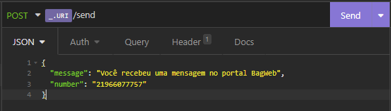

# API de envio de Sms com Twilio

<a href="https://console.twilio.com/?frameUrl=%2Fconsole%3Fx-target-region%3Dus1">
    Access Twilio
</a>

## Send Example

<div align="center" width="100%">
    
</div>

### 🌌 Tecnologias 🌌

- NodeJS

## 💾 Clone

```sh
git clone https://github.com/setxpro/envio-sms-twilio-nodejs.git
```

## Library

```sh
    twilio
    dotenv
    nodemon
    express
```

## 🗳 Install

```sh
yarn install
```

## 🚀 Usage

```sh
    yarn dev
```

## Author

👤 **Patrick Anjos**
